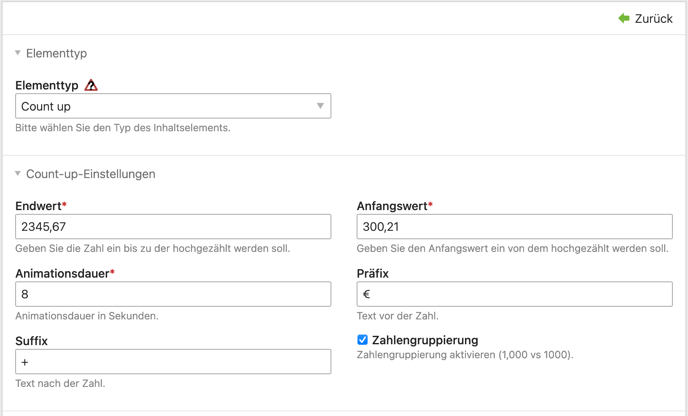

# Contao Count Up Bundle

This Contao content element counts up numbers.  
JThis plugin is based on and utilizes [CountUp.js](https://github.com/inorganik/CountUp.js)

CSS files are not included.

## Install using Composer

```bash
composer require plenta/contao-countup-bundle
```

## Usage
Simply add the Contao element to your page.  
The Contao element accepts the following arguments

- Start value: number to begin the counter from
- Count up value: number to end the counter at
- Animation duration: time in seconds
- Prefix: text at the beginning the value
- Suffix: text added at the end of the value
- Number grouping: enable grouping of numbers (1,000 vs 1000)
- Decimal places are calculated automatically


## Screenshots

